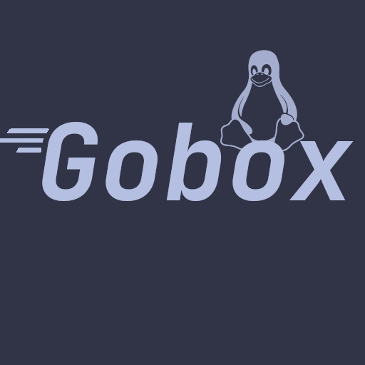

# Gobox

<p align="center">
  
</p>

<p align="center">
  <b>A tiny BusyBox-like userspace toolkit written in Go.</b>
</p>

---

## What is Gobox?

**Gobox** is a small, experimental BusyBox-style utility collection.

It provides multiple Unix-like applets from a single binary:

```sh
gobox sh
gobox ls
gobox cat file.txt
gobox echo hello
gobox fetch
# and more
```
